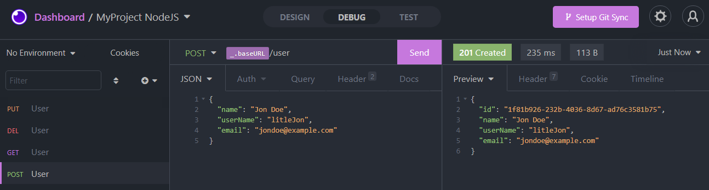
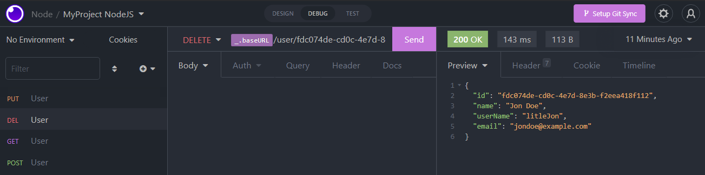

# Projeto de Estudo Node

       

## 💻 Sobre o Projeto

**.**  Esse projeto foi feito para colocar em pratica conceitos que aprendi sobre NodeJs em uma aplicação backend de cadastro de usuário.

**.** Para testar essa aplicação basta fazer o clone do repositório; após isso no terminal da o comando `yarn` para que todas as dependências sejam instalas.

**.** O comando `yarn dev` executa o script que vai inicializar o servidor.

**.** O banco utilizado foi o SQLite. 

## Rotas da aplicação

### POST `/users`
A rota deve receber `name`, `userName` e `email` dentro do corpo da requisição para que seja possível cadastrar um usuário.
```
{
  name: string,
  userName: string,
  email: string
}
```
Em caso de sucesso a rota retorna o status `201` e o usuário cadastrado. Em caso de erro retorna o status `400` e uma mensagem de erro.
```
{
  id: string,
  name: string,
  userName: string,
  email: string
}
```

### GET `/users`

A rota não recebe parâmetros e em caso de sucesso retorna o status `200` e todos os usuários cadastrados.
```
[
  {
    id: "82b7b90c-80ce-4433-bc72-ac9c0aad0b63",
    name: "Dougllas Souza",
    userName: "DOUG",
    email: "dougllas@example.com"
  },
  {
    id: "34f6d981-51fc-4379-b578-14cb337437a0",
    name: "Jon Doe",
    userName: "LitleJon",
    email: "jondoe@example.com"
  }
]
```
Em caso de erro retorna o status `400` e uma mensagem de erro.
### PUT `/users/:id`

A rota deve receber, nos parâmetros da rota, o `id` de um usuário em que vai ser feita a edição do nome ou do email.
No corpo da requisição deve receber o `name` ou o `email` com os novos valores. 
```
{
  name: "Dougllas S. Souza",
  email: "dougllas8@example.com"
}
```
Em caso de sucesso a rota retorna o status `200` e o usuário com os dados atualizados.
```
{
  id: "82b7b90c-80ce-4433-bc72-ac9c0aad0b63",
  name: "Dougllas S. Souza",
  userName: "DOUG",
  email: "dougllas8@example.com"
}
```
Em caso de erro retorna o status `400` e uma mensagem de erro.

### DELETE `/users/:id`
A rota deve receber, nos parâmetros da rota, o `id` de um usuário que vai ser excluido.
Em caso de sucesso a rota retorna o status `200`, o usuário excluido.

```
{
	"id": "fdc074de-cd0c-4e7d-8e3b-f2eea418f112",
	"name": "Jon Doe",
	"userName": "litleJon",
	"email": "jondoe@example.com"
}
```
Em caso de erro retorna o status `400` e uma mensagem de erro.
   
### Imagem `POST`

### Imagem `GET`

### Imagem `PUT`

### Imagem `DELETE`

